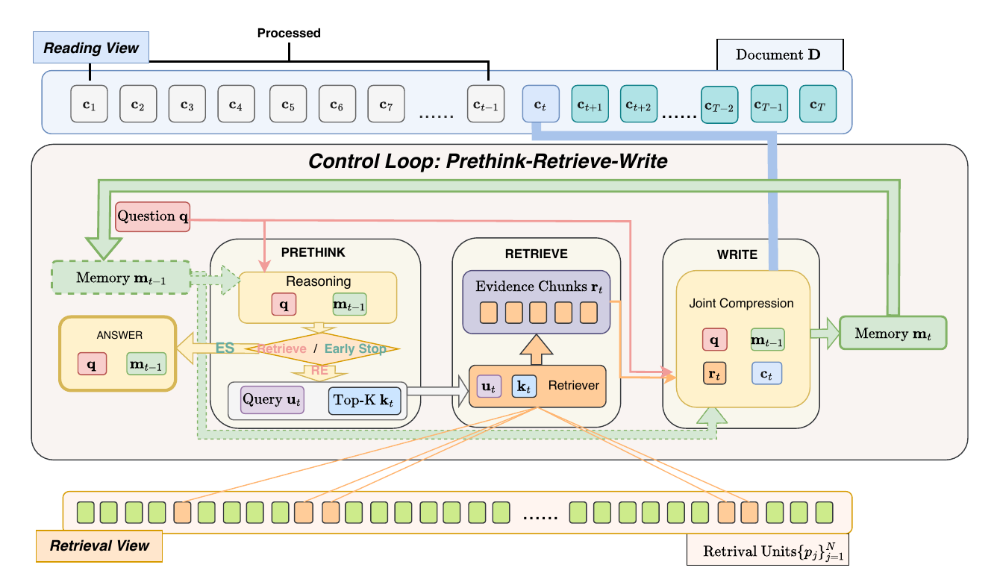
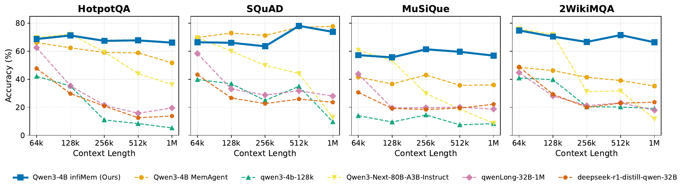
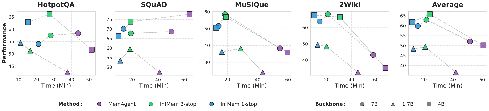

<div align="center">

<h1 style="display: flex; justify-content: center; align-items: center; gap: 10px; margin: 0;">
  InfMem: Control-Centric Bounded-Memory Agent for Ultra-Long Document QA
</h1>

[](https://arxiv.org/pdf/2602.02704)
[](https://huggingface.co/datasets/ucmp137538/infmem_superlong)
<!-- [](https://example.com/infmem-weights) -->

</div>

---

> [!IMPORTANT]
> **🔥 News**
> - **[2026/02]** Initial release: **InfMem** framework + evaluation scripts for ultra-long QA (32K → 1M).
> - **[2026/02]** Training recipe released: **SFT warmup → RL alignment (GRPO)** for reliable control and efficiency.

---

## 📖 Introduction

Reasoning over **ultra-long documents** requires synthesizing **sparse, low-salience evidence** scattered across distant segments under strict compute and memory budgets.  
Streaming agents make scaling possible, but **passive memory updates** often fail to preserve the *bridging evidence* needed for **multi-hop composition**.

We propose **InfMem**, a **bounded-memory** long-context agent that instantiates explicit **System-2-style control** via a **PreThink–Retrieve–Write** loop with **adaptive early stopping**. Instead of relying on passive accumulation, InfMem **actively monitors evidence sufficiency**, performs **targeted in-document retrieval**, and applies **evidence-aware joint compression** to maintain a compact, task-conditioned memory.



---

## ✨ Highlights

- **🧠 Explicit controller (System-2 control)**  
  A structured **PreThink** controller decides *retrieve / write / stop* with state-dependent control records.

- **🔎 In-document retrieval (no external corpus)**  
  Retrieves top-*k* relevant units from the same document to recover *bridging facts* on demand.

- **🧾 Evidence-aware memory writing**  
  Updates a bounded memory with **joint compression** that prioritizes *answer-critical* evidence.

- **⛔ Adaptive early stopping for efficiency**  
  Stops recurrent reasoning once evidence is sufficient, yielding large wall-clock gains at long contexts.

- **📈 Stable scaling to extreme lengths**  
  Maintains strong performance from **32K to 1M tokens**, especially on **multi-hop QA**.

---


## 🏋️ Training: SFT Warmup → RL Alignment (GRPO)

InfMem is trained to produce **protocol-valid actions** and learn **long-horizon control** under delayed feedback:

1. **SFT warmup (distillation)**  
   Distill a strong teacher to follow the exact inference-time protocol (PreThink–Retrieve–Write–Stop), stabilizing control formatting and basic behavior.

2. **RL alignment (GRPO)**  
   Optimize end-task success and efficiency using GRPO-style RL with verifiable rewards.  
   Typical reward components (example):  
   - **Outcome reward** (Exact Match / F1 proxy)  
   - **Early-stop reward** (efficiency bonus when stopping correctly)  
   - **Protocol reward** (valid control records / tool calls)  
   

---

## 📊 Results

**InfMem** demonstrates strong and stable performance on ultra-long QA:

- **Long-context stability (32K → 1M)**: accuracy does not degrade with increasing sequence length.
- **Multi-hop strength**: consistently strong on sparse-evidence multi-hop QA.
- **Efficiency**: adaptive early stopping reduces inference time by **~3.9× on average** (up to **~5.1×**) while improving accuracy over streaming baselines.





> NOTE: Replace the above with your actual tables/figures once finalized.

---

## ⚡ Quickstart

## ⚙️ Installation

We use **two conda environments**:
- `infmem`: training / evaluation codebase dependencies
- `vllmserve`: a newer vLLM for serving models during evaluation

### 1) Create envs

```bash
# (A) main env for infmem
conda create -n infmem python=3.10 -y
conda activate infmem

# install project deps (choose one of the following patterns)
# Option 1: if you have a setup script
bash setup_vllm083.sh

# (B) serving env for vLLM
conda create -n vllmserve python=3.10 -y
conda activate vllmserve

pip install "vllm==0.15.0"
```

## 📦 Dataset
Clone the prepared dataset


```bash
cd hotpotqa
git clone https://huggingface.co/datasets/ucmp137538/infmem_superlong .
```
After cloning, the directory structure should look like:
```bash
hotpotqa/
  ├── data/
  ├── eval_100.json
  ├── eval_200.json
  ├── eval_400.json
  └── ...

```
generate the sft dataset

```bash
## serve the teacher model
conda activate vllmserve
cd taskutils/data_distillation
bash vllm_serve.sh

## download original dataset
conda activate infmem

cd ../memory_data

## Download squad,musique,2wiki
bash download_qa_dataset.sh

cd ../data_distillation
## distill trajectory from our teacher model
python distill.py
```

### 🧩 SFT Training

We provide a script for **Supervised Fine-Tuning (SFT)**, which is used to initialize the model before RL training.

- **`run_sft.sh`**: Run SFT to obtain the base checkpoint for subsequent RL training.

This script follows the **Open-R1** training setup. Please make sure the environment is configured according to the Open-R1 requirements before running SFT.

Before running, ensure:
- The training dataset is prepared and accessible
- The base model path is correctly set
- The environment dependencies follow the Open-R1 specification

```bash
cd open-r1
bash run_sft.sh
```

## 🧠 RL Training

We  alsoprovide two runnable scripts for reinforcement learning (RL) training:

- **`infmem_4B.sh`**: Train the **InfMem** agent.
- **`memagent_4B.sh`**: Reproduce the **MemAgent** baseline under the same RL setup.

These scripts are designed to be **plug-and-play**. Users only need to prepare the dataset and model checkpoints, then launch the scripts directly.

---

### 1) Train InfMem

`infmem_4B.sh` trains the **InfMem** model with RL.

Before running, make sure:
- The dataset is prepared and available under `DATAROOT`
- use the sft checkpoint as the base model
- The output directory exists and has sufficient disk space

```bash
bash infmem_4B.sh
```
The script will automatically:

Launch the RL training process

Save checkpoints to the specified output directory

Log training progress and evaluation metrics

### 2) Reproduce MemAgent
`memagent_4B.sh` is provided to reproduce the **MemAgent** baseline using the same training pipeline and evaluation protocol.

This allows a fair comparison between InfMem and MemAgent under identical experimental conditions.

```bash
bash memagent_4B.sh
```

## 🧪 Evaluation

We provide a simple evaluation pipeline based on **vLLM serving + offline evaluation scripts**.

### 1) Start vLLM servers

First, launch the vLLM servers for all models to be evaluated.

```bash
conda activate vllmserve
cd taskutils/memory_eval
bash vllm_serve.sh
```


Then, launch the evaluation script.

```bash
conda activate infmem

bash test_launcher.sh
```